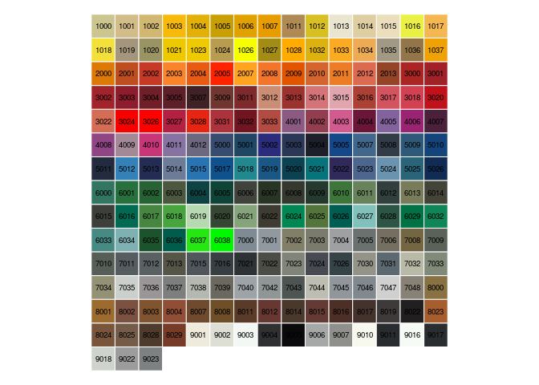

<!-- README.md is generated from README.Rmd. Please edit that file -->
[](https://cran.r-project.org/package=ral) [](https://travis-ci.org/edwindj/ral)

ral
===

Data package containing [RAL classic colors](https://en.wikipedia.org/wiki/RAL_colour_standard), mainly used for varnish and powder coating.

Example
-------

`ral` is a `data.frame` that contains RAL number, color, name, german name and a description.

``` r
head(ral)
#>    RAL   color          name german_name description
#> 1 1000 #CCC58F   Green beige   Grünbeige            
#> 2 1001 #D1BC8A         Beige       Beige            
#> 3 1002 #D2B773   Sand yellow    Sandgelb            
#> 4 1003 #F7BA0B Signal yellow  Signalgelb            
#> 5 1004 #E2B007 Golden yellow    Goldgelb            
#> 6 1005 #C89F04  Honey yellow   Honiggelb
```

`ralcolors` is a named vector that can be used to quickly retrieve a color from the RAL number.

``` r
ralcolors["RAL9010"]
#>   RAL9010 
#> "#F7F9EF"
```

Function `show_ralcolors` shows the color table with corresponding RAL number.

``` r
show_ralcolors()
```



Install
-------

Currently `ral` is not available from CRAN and can be installed with the following:

``` r
devtools::install_github("edwindj/ral")
```
